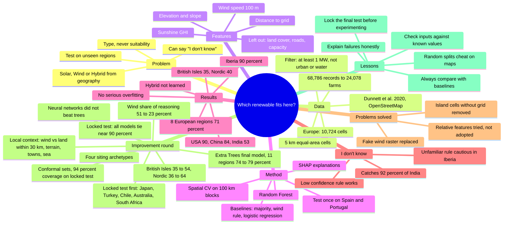

# Project mind map

GitHub draws this diagram automatically.

```mermaid
mindmap
  root((Which renewable fits here?))
    Problem
      Solar, Wind or Hybrid from geography
      Test on unseen regions
      Can say "I don't know"
      Type, never suitability
    Data
      Dunnett et al. 2020, OpenStreetMap
      68,786 records to 24,078 farms
      Filter: at least 1 MW, not urban or water
      5 km equal-area cells
      Europe: 10,724 cells
    Features
      Sunshine GHI
      Wind speed 100 m
      Elevation and slope
      Distance to grid
      Left out: land cover, roads, capacity
    Method
      Random Forest
      Baselines: majority, wind rule, logistic regression
      Spatial CV on 100 km blocks
      Test once on Spain and Portugal
      SHAP explanations
    Results
      Iberia 90 percent
      8 European regions 71 percent
      British Isles 35, Nordic 40
      USA 90, China 84, India 53
      Hybrid not learned
      No serious overfitting
    I don't know
      Low confidence rule works
      Unfamiliar rule cautious in Iberia
      Catches 92 percent of India
    Problems solved
      Fake wind raster replaced
      Island cells without grid removed
      Relative features tried, not adopted
    Improvement round
      Locked test first: Japan, Turkey, Chile, Australia, South Africa
      Local context: wind vs land within 30 km, terrain, towns, sea
      Extra Trees final model, 11 regions 74 to 79 percent
      British Isles 35 to 54, Nordic 36 to 64
      Wind share of reasoning 51 to 23 percent
      Neural networks did not beat trees
      Conformal sets, 94 percent coverage on locked test
      Four siting archetypes
      Locked test: all models tie near 90 percent
    Lessons
      Random splits cheat on maps
      Always compare with baselines
      Check inputs against known values
      Explain failures honestly
      Lock the final test before experimenting
```
